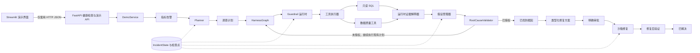
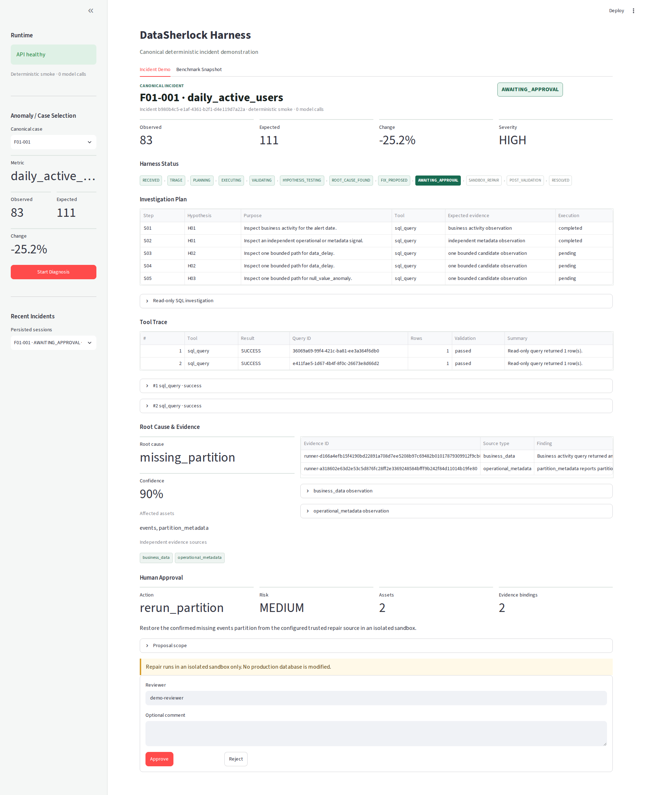
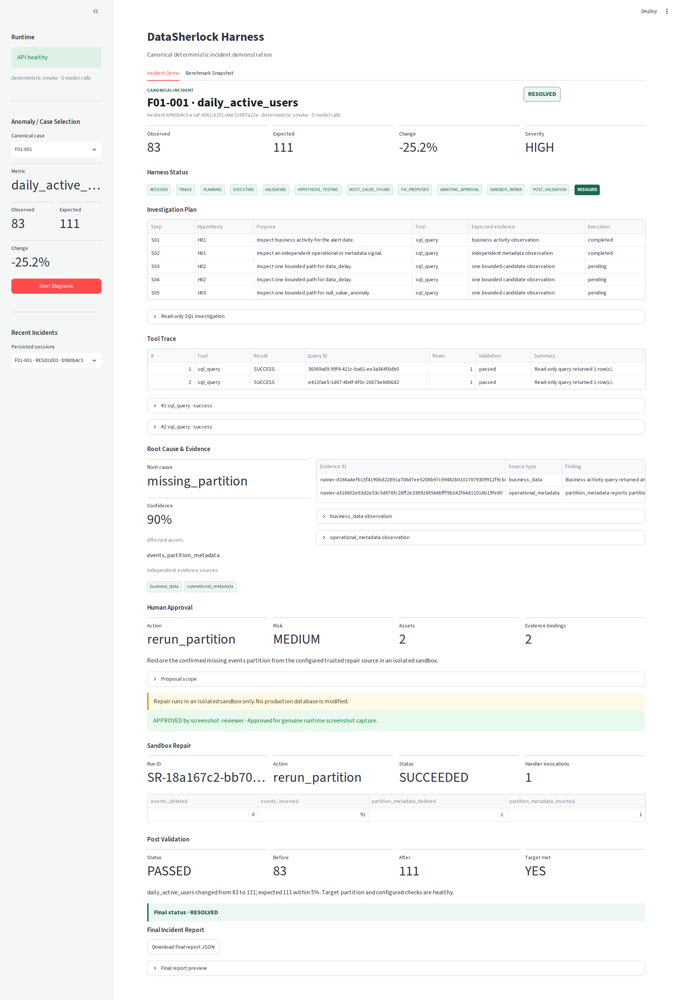

# DataSherlock Harness

面向数据仓库指标异常的可靠自主诊断、验证与审批后恢复系统。

```text
告警 -> 规划器 -> 受控工具执行 -> 证据 -> 假设
     -> RootCauseValidator -> 审批 -> 沙箱修复 -> 修复后验证
```

DataSherlock 是一个专注于工程落地的 Harness，用于调查 SaaS 运营指标异常。它将结构化 Planner、只读工具、显式状态转换、类型化证据准入、根因授权、检查点恢复，以及一条需要审批的沙箱修复路径组合在一起。它不是通用 BI 助手，也不会写入生产数据仓库。

## 概览

一条看似合理的 SQL 结果不足以授权诊断结论。DataSherlock 将候选原因生成、证据收集与最终根因授权明确分离：

1. Planner 提出范围受限的假设和调查步骤。
2. Guardrail 在固定预算内授权已注册的只读工具调用。
3. 工具结果经过验证，并根据事件范围进行解释。
4. `HypothesisManager` 记录支持证据、矛盾证据和置信度。
5. 只有 `RootCauseValidator` 可以授权进入 `ROOT_CAUSE_FOUND`。
6. 类型化修复方案必须经过明确审批，才能在沙箱中执行。
7. 修复后验证必须通过，事件才能进入 `RESOLVED`。

当证据缺失、中性、互相矛盾或超出事件范围时，这种分离设计会将弃答视为预期的安全结果。

## 为什么需要 Harness

常规分析 Agent 通常只把问题转换为 SQL 和文字结论。DataSherlock 负责实现可复现事件工作流所需的执行属性：

- 显式的事件与假设状态机；
- 已注册工具和严格的参数契约；
- 经过 AST 验证、带超时与行数限制的只读 SQL；
- 工具、SQL、轮次和重复调用预算；
- 类型化证据溯源与失败关闭式准入；
- 确定性的根因授权；
- 带版本和校验和的检查点，以及安全的恢复规划；
- 与方案绑定的审批、沙箱修复和修复后验证；
- 确定性故障生成和四种架构评估。

## 核心能力

| 能力 | 状态 |
| --- | --- |
| 确定性 SaaS 数据生成器 | 已实现 |
| F01-F12 标准故障分类 | 已实现 |
| 60 个确定性基准案例 | 已实现 |
| 结构化 Planner 与确定性回退 | 已实现 |
| 只读 SQL 执行与结果验证 | 已实现 |
| 5 个数据质量工具 | 已实现 |
| Tool Registry 与 Tool Executor | 已实现 |
| Guardrail 与预算运行时 | 已实现 |
| HypothesisManager | 已实现 |
| 运行时证据解释器 | 已实现 |
| RootCauseValidator | 已实现 |
| Harness 状态机 | 已实现 |
| 文件检查点与恢复运行时 | 已实现 |
| 需要审批的 F01 沙箱修复 | 已实现 |
| 修复后验证 | 已实现 |
| Benchmark Runner | 已实现 |
| 四种架构消融实验 | 已实现 |
| 逻辑测试夹具指纹 | 已实现 |
| 失败与弃答审计 | 已实现 |
| Streamlit 标准事件演示 | 已实现 |
| 生产级多用户事件控制台 | 不在当前范围内 |
| 生产数据仓库连接器 | 不在当前范围内 |

公共 API 保留 `GET /health`，并增加 `/demo/*` 标准演示端点。这些是演示 API，不是 `chore/project-structure` 中的旧版生产事件 API。

## 架构



组件边界、准确状态机、恢复契约和基准架构详见[系统概览](docs/architecture/system_overview.md)。

## 快速开始

环境要求：Git、Docker Desktop 或 Docker Engine，以及 Docker Compose。

```bash
git clone https://github.com/zy8389/datasherlock-harness.git
cd datasherlock-harness

cp .env.example .env

docker compose up --build
```

Compose 会启动 4 个服务：

| 服务 | 职责 |
| --- | --- |
| `data-init` | 生成 Parquet 产物和 DuckDB 数据库，然后退出 |
| `postgres` | 当前基础设施依赖和健康检查目标 |
| `api` | FastAPI 健康检查与标准 `/demo/*` 端点 |
| `frontend` | 通过 HTTP JSON 使用后端的 Streamlit 标准事件演示 |

打开以下地址：

- API：<http://localhost:8000>
- Streamlit：<http://localhost:8501>

验证 API 及两个依赖项：

```bash
curl http://localhost:8000/health
```

仅当 DuckDB 和 Postgres 均可用时，该端点才返回 `200`；否则返回状态码 `503` 的降级响应。

停止服务栈但不删除数据卷：

```bash
docker compose down
```

## 配置

将 `.env.example` 复制为 `.env`，不要提交凭据。

| 变量 | 用途 |
| --- | --- |
| `API_PORT` | FastAPI 主机端口，默认值为 `8000` |
| `FRONTEND_PORT` | Streamlit 主机端口，默认值为 `8501` |
| `POSTGRES_PORT` | Postgres 主机端口，默认值为 `5432` |
| `POSTGRES_DB` | Postgres 数据库名称 |
| `POSTGRES_USER` | Postgres 用户名 |
| `POSTGRES_PASSWORD` | 本地 Postgres 密码 |
| `DUCKDB_PATH` | API 健康探针使用的 DuckDB 路径 |
| `DEMO_WORKDIR` | 基于文件的演示工作目录，默认值为 `data/demo` |
| `MODEL_PROVIDER` | 模型工厂选择的模型提供方 |
| `OPENAI_API_KEY` | OpenAI 凭据，默认为空 |
| `OPENAI_MODEL` | 调用真实提供方时使用的模型名称 |
| `OPENAI_BASE_URL` | 可选的兼容端点 |
| `LLM_TIMEOUT_SECONDS` | 提供方请求超时时间 |
| `LLM_MAX_RETRIES` | 提供方传输重试次数 |
| `LLM_RETRY_BASE_DELAY_SECONDS` | 提供方重试基础延迟 |
| `RUN_LLM_INTEGRATION_TESTS` | 真实 API 冒烟测试的显式启用开关 |

默认单元测试和基准测试使用确定性模型适配器，不会调用真实模型。执行真实模型需要明确配置提供方、凭据并具备网络连接。

## 数据模型

确定性生成器会将每张表同时写入 Parquet 和一个 DuckDB 数据库。

业务表与指标表：

```text
users
events
subscriptions
experiment_assignments
daily_metrics
```

运维元数据与语义元数据：

```text
partition_metadata
pipeline_runs
schema_snapshots
metric_versions
experiment_configs
```

- DuckDB 是诊断与基准执行数据库。
- Parquet 文件是生成的数据集产物。
- Postgres 是当前 Compose 依赖和健康检查目标。`chore/project-structure` 中的旧版事件持久化 API 不属于 `main`。

在本地生成默认数据集：

```bash
python -m data.generator --output-dir data/processed
```

也可以通过 Compose 运行相同的生成器：

```bash
docker compose run --rm data-init
```

生成器还支持显式传入 `--users`、`--days`、`--events`、`--seed` 和 `--start-date`；可运行 `python -m data.generator --help` 查看经过验证的接口。

## 故障基准

`config/fault_catalog.yaml` 定义了 F01-F12 共 12 类标准故障。`benchmark/ground_truth/` 为每一类保存一个种子契约，`benchmark/cases/` 为每一类保存 5 个确定性案例，共 60 个案例。

| ID | 根因 | 主要指标 |
| --- | --- | --- |
| F01 | 分区缺失 | 日活跃用户数 |
| F02 | 批次重复 | AI 任务数 |
| F03 | 空值异常 | 日活跃用户数 |
| F04 | 数据延迟 | 日活跃用户数 |
| F05 | 时区错误 | 日活跃用户数 |
| F06 | 单位错误 | 平均会话时长 |
| F07 | 关联过滤错误 | 日活跃用户数 |
| F08 | 关联膨胀 | AI 任务数 |
| F09 | 字段漂移 | AI 任务数 |
| F10 | 模式变更 | 日活跃用户数 |
| F11 | 指标定义变更 | 日活跃用户数 |
| F12 | A/B 分流异常 | 转化率 |

检查已提交清单是否仍与生成器和标准契约一致，且不重写文件：

```bash
python -m benchmark.case_generator --check
```

## 运行一个标准端到端案例

项目没有独立的 `python -m benchmark.runner --case ...` 命令行接口。F01 基准测试是单个标准案例的公开、确定性验证方式：

```bash
python -m pytest -q tests/benchmark/test_f01_repair_e2e.py
```

该测试会实例化 `F01-001`，通过当前 Harness 完成诊断，创建类型化修复方案，记录明确审批，在隔离沙箱中修复 DuckDB 副本，执行修复后验证，并断言状态为 `RESOLVED`。它还会证明审批被拒绝时不会创建沙箱。

## 运行消融基准

确定性冒烟测试无需凭据，用于验证接线和编排：

```bash
python experiments/ablation/run.py \
  --config experiments/ablation/config.example.yaml \
  --smoke \
  --run-id wiring-smoke
```

冒烟测试输出不是科学准确率测量结果。

完整真实运行需要配置提供方、模型、凭据和网络连接：

```bash
python experiments/ablation/run.py \
  --config experiments/ablation/config.example.yaml \
  --full \
  --run-id full-60
```

它会让 60 个案例分别运行 4 种变体，共生成 240 个案例与变体组合：

```text
single_prompt
react
state_graph_no_validator
full_harness
```

`--resume` 只有在已持久化配置、提供方与模型标识、变体，以及物理与逻辑测试夹具标识均通过验证后，才会复用已完成的组合。

## 冻结的评估结果

已接受的历史测量结果为 `full-60-4arch-post-pr14-20260831`：

| 变体 | Top-1 | Top-3 | 错误数 | 弃答数 |
| --- | ---: | ---: | ---: | ---: |
| 单提示词 | 0.2333 | 0.3833 | 4 | 4 |
| ReAct | 0.3500 | 0.4667 | 10 | 10 |
| 无验证器状态图 | 0.0833 | 0.2000 | 42 | 0 |
| 完整 Harness | 0.0000 | 0.2500 | 36 | 60 |

这些是冻结的历史结果，不代表当前 `main` 的准确率。PR #17 至 #20 之后没有重新执行真实模型 60x4 运行，因此不宣称完整 Harness 的准确率有所提升。

在 24 个没有运行时错误但发生弃答的完整 Harness 案例中，最早原因分别为 4 个 `HYPOTHESIS_MISSING`、5 个 `EVIDENCE_MISSING` 和 15 个 `EVIDENCE_NEUTRALIZED`。没有任何黄金候选满足验证器门控条件，因此 `RootCauseValidator` 并不是第一个瓶颈。

历史运行之间只有 32/60 个测试夹具的 DuckDB 物理字节一致。之后引入的版本化逻辑测试夹具指纹确认了 60/60 的逻辑一致性，并成为新运行采用的科学标识。

详细资料：

- [失败分析](docs/evaluation/failure_analysis.md)
- [基准可复现性](docs/evaluation/benchmark_reproducibility.md)
- [完整 Harness 弃答审计](docs/evaluation/full_harness_abstention_audit.md)
- [PR #19 后证据回放](docs/evaluation/post_pr19_evidence_replay.md)
- [冻结的 Planner 覆盖率审计](docs/evaluation/frozen_plan_evidence_coverage.md)
- [消融实验指南](experiments/ablation/README.md)

提供方的令牌或费率数据可能不完整。未知成本会报告为 `null` 或未知，绝不会报告为零。

## 证据与验证契约

规划与证据转换共享同一套标准运行时溯源规则：

| 来源类型 | 资产 |
| --- | --- |
| `business_data` | `events`、`users`、`subscriptions`、`experiment_assignments`、`daily_metrics` |
| `operational_metadata` | `partition_metadata`、`pipeline_runs` |
| `schema_metadata` | `schema_snapshots` |
| `metric_version` | `metric_versions` |
| `experiment_config` | `experiment_configs` |

未知资产会触发失败关闭。混合多个来源类别的一条 SQL 语句不会被计为两个独立来源，对业务表执行两次查询仍然只算一种来源类型。

每个提出的假设必须至少有一个规划步骤。对于在目录中声明多来源证据的故障，不同规划步骤必须覆盖声明的每个 `evidence_source_types` 条目。Planner 上下文包含这些来源类型以及 `verification_fields` 和 `expected_evidence`，但它们只是候选诊断目标，不是已观测事实或 Ground Truth 答案。

成功的 SQL 调用不等同于根因证据。运行时准入要求可识别、类型化且结构化的观测，并且该观测必须兼容当前假设和事件范围。潜在影响不等于根因证明。例如，F07 的存活行损失结果不能证明当前指标定义使用了错误关联，因此该观测仍保持中性。

按当前默认配置，`RootCauseValidator` 只在以下条件全部满足时授权根因：

- 假设状态为 `SUPPORTED`；
- 至少绑定两个支持证据引用；
- 至少存在两种独立的标准来源类型；
- 置信度不低于 `0.75`；
- 没有证据缺失，也没有阻断性矛盾。

当假设状态为 `PROPOSED` 或 `TESTING` 时，例行验证器调用会返回 `validated=False`；这并不表示验证器拒绝了假设。

## 安全与恢复

默认 `GuardrailPolicy` 仅允许调用已注册的只读工具，并采用以下配置：

```text
max_agent_rounds = 20
max_tool_calls = 20
max_sql_calls = 15
tool_timeout_seconds = 30
max_result_rows = 1000
max_duplicate_calls = 1
max_repair_retries = 2
```

SQL 由 `sqlglot` 解析，再通过 DuckDB 语句元数据检查，以 `read_only=True` 执行，并禁用外部访问。不安全 SQL、未知工具、无效参数、预算耗尽、重复调用、超时和截断都会记录为结构化 Guardrail 或执行结果。

`IncidentState` 是运行时事实来源。文件检查点提供：

- 带版本的持久化 JSON 序列化和 SHA-256 完整性校验；
- 原子替换和目录同步；
- 恢复游标和已完成步骤指纹；
- 确定性工具调用 ID 与重放保护；
- 持久化的 Guardrail 使用量和事件记录；
- HypothesisManager 与证据重建；
- 较新文件损坏时回退到最新有效检查点；
- 对不受支持的未来模式版本进行失败关闭处理。

当前唯一可执行的修复处理器是类型化 F01 `rerun_partition` 路径。方案内容通过哈希绑定支持证据和范围；审批绑定到该方案；执行时会把源数据库复制到受限沙箱；持久化终止产物支持崩溃恢复；只读修复后验证会检查目标和回归。系统不会直接自动修改生产环境。

## 项目结构

```text
app/                    仅通过 HTTP 访问后端的 Streamlit 事件演示
benchmark/              标准案例、Ground Truth 与变体输入
config/                 指标语义与故障契约
docs/                   架构和冻结评估报告
experiments/ablation/   四种架构的编排与报告
src/agents/             结构化 Planner
src/benchmark/          运行器、评分、指纹与离线审计
src/data/               确定性 SaaS 数据生成器
src/harness/            状态图、假设、Guardrail、检查点与修复
src/llm/                与提供方无关的模型边界
src/tools/              注册表、执行器、只读 SQL 与数据质量工具
src/validators/         SQL 结果与根因验证
tests/                  单元、集成与基准质量门禁
```

## 架构文档

建议从[架构索引](docs/architecture/README.md)开始，再查看 Planner、证据和数据质量契约的专题文档。

## 演示截图

### F01 等待人工审批



当前 Harness 已授权根因 `missing_partition`，绑定两个独立证据来源，并停在 `AWAITING_APPROVAL`。截图来自真实 Docker Compose 运行环境。

### F01 在沙箱中解决



批准后的修复在隔离沙箱中只运行一次，通过当前修复后验证并进入 `RESOLVED`。截图来自同一真实运行环境。

## 已知限制

1. PR #20 之后尚未运行新的真实模型 60x4 基准。
2. 冻结的历史完整 Harness Top-1 仍为 `0.0`，本文不宣称其有所提升。
3. 历史审计中有 4 个无错误案例遗漏了黄金假设。
4. F02、F03、F06、F07、F08 和 F09 尚无完整的目录声明独立来源契约。
5. F05、F06、F07、F08、F09 和 F12 仍需要更强的因果运行时观测。
6. 提供方令牌和货币计费信息可能不完整，因此成本可能为未知。
7. Streamlit 实现的是确定性的标准事件演示，不是生产级多用户事件管理控制台。
8. 交互式修复当前仅支持 5 个经过验证的 F01 演示案例。
9. 生产数据仓库连接和生产写入不在当前范围内。
10. `chore/project-structure` 包含尚未移植的事件 API、审批认证、Postgres 检查点、乐观修订和审计流等概念。它们属于旧分支能力，不代表当前 `main` 的运行时行为。

## 开发与验证

在 Python 3.11 或更高版本中安装软件包和开发工具：

```bash
python -m pip install -e ".[dev]"
python -m pytest -q
python -m ruff check .
python -m compileall -q src tests experiments
python -m benchmark.case_generator --check
docker compose config --quiet
```

除非设置 `RUN_LLM_INTEGRATION_TESTS=1`、`OPENAI_API_KEY` 和 `OPENAI_MODEL`，否则真实 OpenAI 集成冒烟测试会保持跳过。

## 故障排查

### Docker 已启动，但 API 处于降级状态

运行 `docker compose ps`，并检查 `curl http://localhost:8000/health` 返回的 `duckdb` 和 `postgres` 字段。如果任一依赖不可用，API 会有意返回 `503`。

### LLM 测试被跳过

当 `RUN_LLM_INTEGRATION_TESTS=0` 时，这是预期行为。默认测试套件不会调用真实提供方。

### 完整基准无法启动

检查 `OPENAI_API_KEY`、`OPENAI_MODEL`、所选提供方和网络连接。`--full` 还要求准确选择全部 60 个案例。

### 为什么冻结的完整 Harness Top-1 为零？

[失败分析](docs/evaluation/failure_analysis.md)表明，规划和证据准入是根因授权之前测得的瓶颈。简单地把结果归因于验证器过严并不准确。
