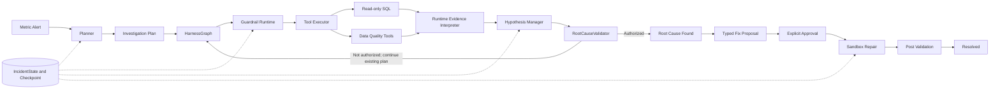
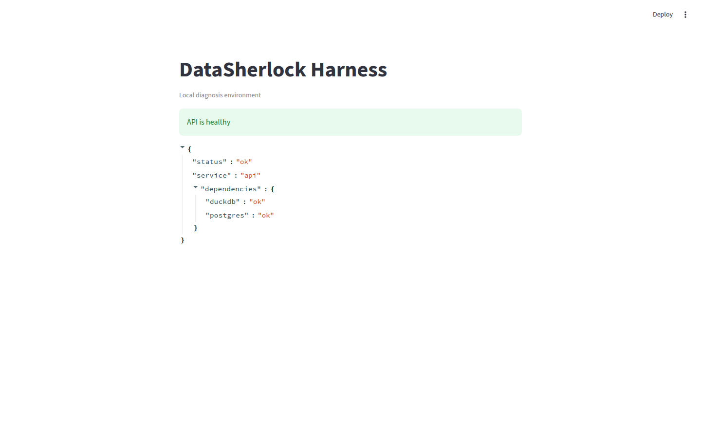
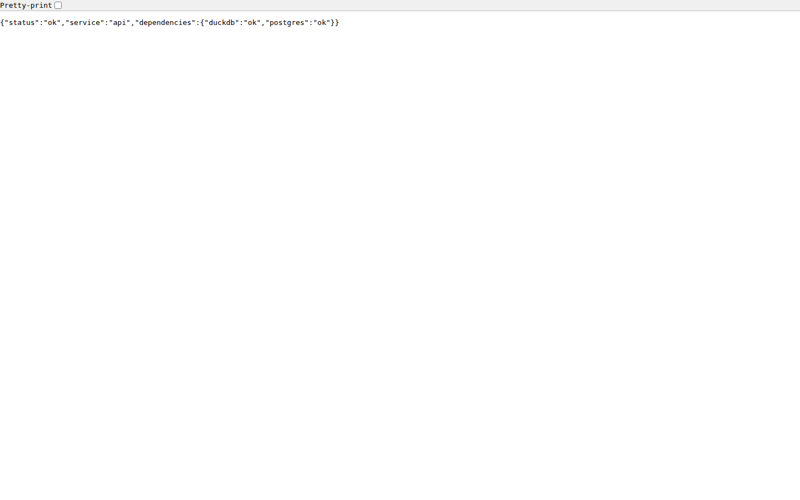

# DataSherlock Harness

Reliable autonomous diagnosis, validation, and approval-gated recovery for
data warehouse metric anomalies.

```text
Alert -> Planner -> Guarded Tool Execution -> Evidence -> Hypothesis
      -> RootCauseValidator -> Approval -> Sandbox Repair -> Post Validation
```

DataSherlock is an implementation-focused Harness for investigating anomalies
in SaaS operating metrics. It combines a structured Planner, read-only tools,
explicit state transitions, typed evidence admission, root-cause authorization,
checkpoint recovery, and one approval-gated sandbox repair path. It is not a
general BI assistant and it does not write to a production warehouse.

## Overview

A plausible SQL result is not enough to authorize a diagnosis. DataSherlock
separates candidate generation from evidence collection and final root-cause
authorization:

1. The Planner proposes bounded hypotheses and investigation steps.
2. Guardrails authorize registered, read-only tool calls within fixed budgets.
3. Tool results are validated and interpreted against incident scope.
4. `HypothesisManager` records support, contradiction, and confidence.
5. `RootCauseValidator` alone authorizes `ROOT_CAUSE_FOUND`.
6. A typed repair proposal requires explicit approval before sandbox execution.
7. Post-repair validation must pass before the incident becomes `RESOLVED`.

This separation makes abstention an expected safety outcome when evidence is
missing, neutral, contradictory, or outside the incident scope.

## Why A Harness

A typical analysis agent turns a question into SQL and prose. DataSherlock owns
the execution properties needed for a reproducible incident workflow:

- explicit incident and hypothesis state machines;
- registered tools and strict argument contracts;
- AST-validated, read-only SQL with timeout and row limits;
- tool, SQL, round, and duplicate-call budgets;
- typed evidence provenance and fail-closed admission;
- deterministic root-cause authorization;
- versioned, checksummed checkpoints and safe resume planning;
- proposal-bound approval, sandbox repair, and post-validation;
- deterministic fault generation and four-architecture evaluation.

## Key Capabilities

| Capability | Status |
| --- | --- |
| Deterministic SaaS data generator | Implemented |
| F01-F12 canonical fault taxonomy | Implemented |
| 60 deterministic benchmark cases | Implemented |
| Structured Planner and deterministic fallback | Implemented |
| Read-only SQL execution and result validation | Implemented |
| Five Data Quality tools | Implemented |
| Tool Registry and Tool Executor | Implemented |
| Guardrail and budget runtime | Implemented |
| HypothesisManager | Implemented |
| Runtime evidence interpreter | Implemented |
| RootCauseValidator | Implemented |
| Harness state machine | Implemented |
| File checkpoint and resume runtime | Implemented |
| Approval-gated F01 sandbox repair | Implemented |
| Post-repair validation | Implemented |
| Benchmark Runner | Implemented |
| Four-architecture ablation | Implemented |
| Logical fixture fingerprint | Implemented |
| Failure and abstention audits | Implemented |
| Full diagnosis Streamlit UI | Pending / P1 |
| Production warehouse connector | Out of current scope |

The current public API is `GET /health`. The current Streamlit application is a
health shell, not the final diagnostic interface.

## Architecture



See [System Overview](docs/architecture/system_overview.md) for the component
boundaries, exact state machine, recovery contract, and benchmark architecture.

## Quick Start

Requirements: Git, Docker Desktop or Docker Engine, and Docker Compose.

```bash
git clone https://github.com/zy8389/datasherlock-harness.git
cd datasherlock-harness

cp .env.example .env

docker compose up --build
```

Compose starts four services:

| Service | Responsibility |
| --- | --- |
| `data-init` | Generates Parquet artifacts and the DuckDB database, then exits |
| `postgres` | Current infrastructure dependency and health target |
| `api` | FastAPI service exposing `GET /health` |
| `frontend` | Streamlit health shell |

Open:

- API: <http://localhost:8000>
- Streamlit: <http://localhost:8501>

Verify the API and both dependencies:

```bash
curl http://localhost:8000/health
```

The endpoint returns `200` only when both DuckDB and Postgres are available;
otherwise it returns a degraded response with status `503`.

Stop the stack without deleting volumes:

```bash
docker compose down
```

## Configuration

Copy `.env.example` to `.env`. Do not commit credentials.

| Variable | Purpose |
| --- | --- |
| `API_PORT` | Host port for FastAPI, default `8000` |
| `FRONTEND_PORT` | Host port for Streamlit, default `8501` |
| `POSTGRES_PORT` | Host port for Postgres, default `5432` |
| `POSTGRES_DB` | Postgres database name |
| `POSTGRES_USER` | Postgres user |
| `POSTGRES_PASSWORD` | Local Postgres password |
| `DUCKDB_PATH` | DuckDB path used by the API health probe |
| `MODEL_PROVIDER` | Model provider selected by the model factory |
| `OPENAI_API_KEY` | OpenAI credential; empty by default |
| `OPENAI_MODEL` | Model name for real-provider execution |
| `OPENAI_BASE_URL` | Optional compatible endpoint |
| `LLM_TIMEOUT_SECONDS` | Provider request timeout |
| `LLM_MAX_RETRIES` | Provider transport retry count |
| `LLM_RETRY_BASE_DELAY_SECONDS` | Provider retry base delay |
| `RUN_LLM_INTEGRATION_TESTS` | Opt-in flag for the real API smoke test |

The default unit and benchmark tests use deterministic model adapters and make
no real model calls. Real model execution requires explicit provider settings,
credentials, and connectivity.

## Data Model

The deterministic generator writes every table to Parquet and to one DuckDB
database.

Business and metric tables:

```text
users
events
subscriptions
experiment_assignments
daily_metrics
```

Operational and semantic metadata:

```text
partition_metadata
pipeline_runs
schema_snapshots
metric_versions
experiment_configs
```

- DuckDB is the diagnostic and benchmark execution database.
- Parquet files are generated dataset artifacts.
- Postgres is a current Compose dependency and health target. The legacy
  `chore/project-structure` incident persistence API is not part of `main`.

Generate the default dataset locally:

```bash
python -m data.generator --output-dir data/processed
```

Or run the same generator through Compose:

```bash
docker compose run --rm data-init
```

The generator also supports explicit `--users`, `--days`, `--events`, `--seed`,
and `--start-date` values; inspect the validated interface with
`python -m data.generator --help`.

## Fault Benchmark

`config/fault_catalog.yaml` defines twelve canonical fault families, F01-F12.
`benchmark/ground_truth/` contains one seed contract per family and
`benchmark/cases/` contains five deterministic cases per family, for 60 cases.

| ID | Root cause | Primary metric |
| --- | --- | --- |
| F01 | Missing partition | Daily active users |
| F02 | Duplicate batch | AI task count |
| F03 | Null-value anomaly | Daily active users |
| F04 | Data delay | Daily active users |
| F05 | Timezone error | Daily active users |
| F06 | Unit error | Average session duration |
| F07 | Join filter | Daily active users |
| F08 | Join explosion | AI task count |
| F09 | Field drift | AI task count |
| F10 | Schema change | Daily active users |
| F11 | Metric-definition change | Daily active users |
| F12 | A/B split anomaly | Conversion rate |

Check that committed manifests still match the generator and canonical
contracts without rewriting them:

```bash
python -m benchmark.case_generator --check
```

## Run One Canonical End-To-End Case

There is no standalone `python -m benchmark.runner --case ...` CLI. The public,
deterministic proof for one canonical case is the F01 benchmark test:

```bash
python -m pytest -q tests/benchmark/test_f01_repair_e2e.py
```

It materializes `F01-001`, runs diagnosis through the current Harness, creates a
typed repair proposal, records explicit approval, repairs a DuckDB copy in an
isolated sandbox, performs post-validation, and asserts `RESOLVED`. It also
proves that rejected approval creates no sandbox.

## Run The Ablation Benchmark

The deterministic smoke validates wiring and orchestration without credentials:

```bash
python experiments/ablation/run.py \
  --config experiments/ablation/config.example.yaml \
  --smoke \
  --run-id wiring-smoke
```

Smoke output is not a scientific accuracy measurement.

The real full run requires a configured provider, model, credential, and network
connectivity:

```bash
python experiments/ablation/run.py \
  --config experiments/ablation/config.example.yaml \
  --full \
  --run-id full-60
```

It executes 60 cases across four variants, producing 240 case/variant pairs:

```text
single_prompt
react
state_graph_no_validator
full_harness
```

`--resume` reuses completed pairs only after validating persisted config,
provider/model identity, variants, and physical/logical fixture identities.

## Frozen Evaluation Results

The accepted historical measurement is
`full-60-4arch-post-pr14-20260831`:

| Variant | Top-1 | Top-3 | Errors | Abstentions |
| --- | ---: | ---: | ---: | ---: |
| Single Prompt | 0.2333 | 0.3833 | 4 | 4 |
| ReAct | 0.3500 | 0.4667 | 10 | 10 |
| State Graph No Validator | 0.0833 | 0.2000 | 42 | 0 |
| Full Harness | 0.0000 | 0.2500 | 36 | 60 |

These are frozen historical results, not current-main accuracy. PRs #17-#20
were not followed by a fresh real-model 60x4 run, so no Full Harness accuracy
improvement is claimed.

For the 24 Full Harness abstentions without runtime errors, the earliest causes
were 4 `HYPOTHESIS_MISSING`, 5 `EVIDENCE_MISSING`, and 15
`EVIDENCE_NEUTRALIZED`. Zero golden candidates were eligible for the validator
gate; `RootCauseValidator` was therefore not the first bottleneck.

Physical DuckDB bytes matched across historical runs for only 32/60 fixtures.
The versioned logical fixture fingerprint introduced later established 60/60
logical equality and is now the scientific identity used by new runs.

Details:

- [Failure Analysis](docs/evaluation/failure_analysis.md)
- [Benchmark Reproducibility](docs/evaluation/benchmark_reproducibility.md)
- [Full Harness Abstention Audit](docs/evaluation/full_harness_abstention_audit.md)
- [Post-PR19 Evidence Replay](docs/evaluation/post_pr19_evidence_replay.md)
- [Frozen Planner Coverage Audit](docs/evaluation/frozen_plan_evidence_coverage.md)
- [Ablation Guide](experiments/ablation/README.md)

Provider token or rate data may be incomplete. Unknown cost is reported as
`null`/unknown, never as zero.

## Evidence And Validation Contract

Canonical runtime provenance is shared by planning and evidence conversion:

| Source type | Assets |
| --- | --- |
| `business_data` | `events`, `users`, `subscriptions`, `experiment_assignments`, `daily_metrics` |
| `operational_metadata` | `partition_metadata`, `pipeline_runs` |
| `schema_metadata` | `schema_snapshots` |
| `metric_version` | `metric_versions` |
| `experiment_config` | `experiment_configs` |

Unknown assets fail closed. One SQL statement that mixes source classes does
not count as two independent sources, and two queries over business tables are
still one source type.

Every proposed hypothesis must have at least one planned step. For a fault with
catalog-declared multi-source evidence, distinct planned steps must cover every
declared `evidence_source_types` entry. Planner context includes those source
types plus `verification_fields` and `expected_evidence`, but only as candidate
diagnostic objectives. They are not observed facts or Ground Truth answers.

A successful SQL call is not root-cause evidence. Runtime admission requires a
recognized, typed, structured observation that is compatible with the active
hypothesis and incident scope. Potential impact is not root-cause proof: for
example, an F07 survivor-loss result does not prove that the active metric
definition used the faulty join, so that observation remains neutral.

With current defaults, `RootCauseValidator` authorizes a root cause only when:

- the hypothesis is `SUPPORTED`;
- at least two supporting evidence references are bound;
- at least two independent canonical source types are present;
- confidence is at least `0.75`;
- no evidence is missing and no blocking contradiction remains.

Routine validator calls while a hypothesis is `PROPOSED` or `TESTING` return
`validated=False`; that is not a validator rejection.

## Safety And Recovery

The default `GuardrailPolicy` permits only registered read-only tools and uses:

```text
max_agent_rounds = 20
max_tool_calls = 20
max_sql_calls = 15
tool_timeout_seconds = 30
max_result_rows = 1000
max_duplicate_calls = 1
max_repair_retries = 2
```

SQL is parsed with `sqlglot`, checked again through DuckDB statement metadata,
executed with `read_only=True`, and has external access disabled. Unsafe SQL,
unknown tools, invalid arguments, budget exhaustion, duplicate calls, timeouts,
and truncation are recorded as structured guardrail or execution results.

`IncidentState` is the runtime source of truth. File checkpoints provide:

- versioned, durable JSON serialization and SHA-256 integrity checks;
- atomic replace and directory synchronization;
- a resume cursor and completed-step fingerprints;
- deterministic tool-call IDs and replay protection;
- persisted guardrail usage and event records;
- HypothesisManager/evidence rehydration;
- fallback to the newest valid checkpoint when a newer file is corrupt;
- fail-closed handling of unsupported future schema versions.

The only executable repair handler is the typed F01 `rerun_partition` path.
Proposal content is hash-bound to supporting evidence and scope; approval is
bound to that proposal; execution copies the source database to a confined
sandbox; a durable terminal artifact supports crash recovery; and read-only
post-validation checks the target and regressions. There is no direct automatic
production mutation.

## Project Structure

```text
app/                    Streamlit health shell
benchmark/              canonical cases, Ground Truth, and variant inputs
config/                 metric semantics and fault contracts
docs/                   architecture and frozen evaluation reports
experiments/ablation/   four-architecture orchestration and reports
src/agents/             structured Planner
src/benchmark/          runner, scoring, fingerprints, and offline audits
src/data/               deterministic SaaS generator
src/harness/            state graph, hypotheses, guardrails, checkpoints, repair
src/llm/                provider-neutral model boundary
src/tools/              registry, executor, read-only SQL, and DQ tools
src/validators/         SQL result and root-cause validation
tests/                  unit, integration, and benchmark gates
```

## Architecture Docs

Start with the [Architecture Index](docs/architecture/README.md), then use the
specialist documents for Planner, evidence, and Data Quality contracts.

## Demo Screenshots

### Current Streamlit Health Shell



Current Streamlit health shell. Full diagnosis UI remains P1. This screenshot
was captured from the real Docker Compose runtime in GitHub Actions.

### API Health



The current public API exposes `GET /health`, which verifies both DuckDB and
Postgres dependencies. This screenshot was captured from the same real runtime.

## Known Limitations

1. No post-PR20 real-model 60x4 benchmark has been run.
2. Frozen historical Full Harness Top-1 remains `0.0`; no improvement claim is made.
3. Four audited no-error cases historically omitted the golden hypothesis.
4. F02/F03/F06/F07/F08/F09 have no complete catalog-declared independent source contract.
5. F05/F06/F07/F08/F09/F12 still need stronger causal runtime observations.
6. Provider token/currency accounting can be incomplete, so cost can be unknown.
7. Streamlit is a health shell, not the final diagnosis UI.
8. Production warehouse connectivity and production writes are out of scope.
9. `chore/project-structure` contains unported incident API, approval-authentication,
   Postgres checkpoint, optimistic-revision, and audit-stream concepts. They are
   legacy branch capabilities, not current-main runtime behavior.

## Development And Validation

Install the package and developer tools in Python 3.11 or newer:

```bash
python -m pip install -e ".[dev]"
python -m pytest -q
python -m ruff check .
python -m compileall -q src tests experiments
python -m benchmark.case_generator --check
docker compose config --quiet
```

The real OpenAI integration smoke remains skipped unless
`RUN_LLM_INTEGRATION_TESTS=1`, `OPENAI_API_KEY`, and `OPENAI_MODEL` are set.

## Troubleshooting

### Docker starts but the API is degraded

Run `docker compose ps` and inspect the `duckdb` and `postgres` fields returned
by `curl http://localhost:8000/health`. The API intentionally reports `503` if
either dependency is unavailable.

### LLM tests are skipped

This is expected with `RUN_LLM_INTEGRATION_TESTS=0`. The default suite does not
call a real provider.

### The full benchmark cannot start

Check `OPENAI_API_KEY`, `OPENAI_MODEL`, the selected provider, and network
connectivity. `--full` also requires the exact 60-case selection.

### Why is frozen Full Harness Top-1 zero?

The [Failure Analysis](docs/evaluation/failure_analysis.md) shows that planning
and evidence admission preceded root-cause authorization as the measured
bottlenecks. It is inaccurate to attribute the result simply to a strict
validator.
