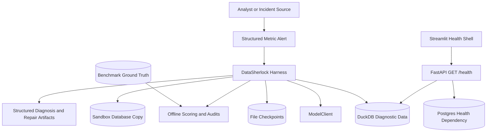
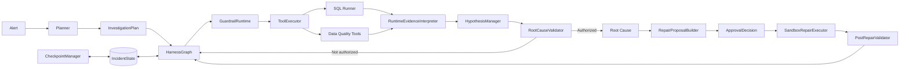
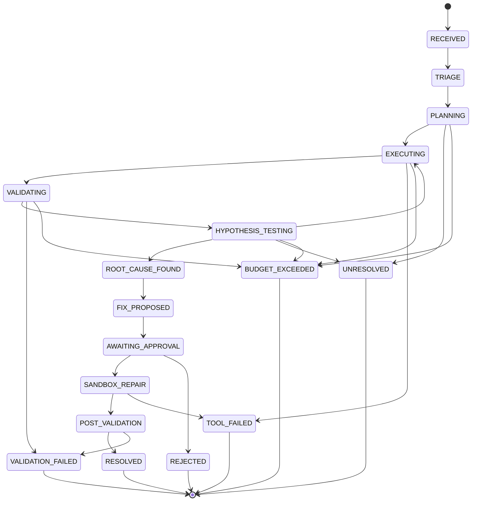

# DataSherlock Harness System Overview

## 1. Scope

DataSherlock Harness investigates anomalies in six configured SaaS operating
metrics against a deterministic local data environment. Current `main` owns the
diagnostic runtime, evidence lifecycle, checkpoint recovery, benchmark system,
and one approval-gated F01 sandbox repair path.

The current product boundary excludes a full diagnosis UI, a production
warehouse connector, direct production writes, and the legacy incident API and
Postgres checkpoint repository that remain only on `chore/project-structure`.

## 2. System Context



Ground Truth is available to offline generation, scoring, and forensic audits.
It is deliberately excluded from Planner and runtime evidence inputs.

## 3. Component Architecture



The principal ownership boundaries are:

- `Planner` proposes candidates and read-only investigation steps.
- `HarnessGraph` owns legal incident transitions and coordinates injected collaborators.
- `GuardrailRuntime` authorizes calls and maintains persisted usage counters.
- `ToolExecutor` validates and dispatches registered tools.
- `RuntimeEvidenceInterpreter` decides whether a result supports, contradicts,
  or is neutral for one active hypothesis.
- `HypothesisManager` owns candidate state, evidence bindings, and confidence.
- `RootCauseValidator` is the only final diagnosis authorization gate.
- Repair modules own immutable artifacts, bindings, sandbox execution, and validation.

## 4. Runtime Diagnosis Flow

1. A structured `Alert` and canonical metric context enter the Planner.
2. The Planner returns 3-5 candidate hypotheses and at most 10 steps.
3. Semantic validation rejects unknown labels, tools, arguments, unsafe SQL,
   missing per-hypothesis steps, and missing declared evidence-source paths.
4. `HarnessGraph` enters `EXECUTING` and selects the next checkpoint cursor step.
5. `GuardrailRuntime.preflight()` applies registry, SQL, budget, and duplicate checks.
6. `ToolExecutor` uses either the SQL adapter or one of five DQ adapters.
7. Successful execution enters `VALIDATING`; execution or authorization failure
   enters a terminal state or budget terminal as defined by the graph.
8. The runtime interpreter admits only recognized, scoped, causally meaningful evidence.
9. `HypothesisManager` attaches polarity and updates candidate confidence/status.
10. `RootCauseValidator` authorizes a supported candidate or the graph requests
    another evidence step.
11. Exhausted or insufficient investigations terminate without inventing a conclusion.

## 5. State Machine

`IncidentStatus` in `src/harness/state.py` defines the states and
`ALLOWED_TRANSITIONS` in `src/harness/graph.py` is the only topology source.



Transition guards require, among other things, a valid alert before triage, MVP
scope before planning, a non-empty plan before execution, an authorized
validator result before `ROOT_CAUSE_FOUND`, a bound approval before repair, a
successful repair before post-validation, and a passing typed result before
`RESOLVED`.

## 6. Evidence Model

`EvidenceReference` stores a stable evidence ID, canonical `source_type`,
description, optional query ID, and structured observation. SQL success,
validation success, Planner prose, and plausible column aliases are not
evidence by themselves.

Runtime SQL admission requires:

1. successful execution;
2. a passed, usable SQL result validation;
3. complete and non-truncated structured rows;
4. a typed rule compatible with the active hypothesis;
5. matching metric, date, dimension, source, join, and projection scope; and
6. returned values that prove support or contradiction.

Anything else is `NEUTRAL`. Only `SUPPORTS` and `CONTRADICTS` are attached to a
hypothesis. The runtime interpreter never receives case IDs, expected labels,
fault manifests, or Ground Truth objects.

The key safety rule is:

```text
potential impact != root-cause proof
```

For example, subscription survivor loss may show possible F07 impact, but it
does not show that the active metric definition used the faulty join. That
observation remains neutral.

## 7. Planner Evidence-Source Contract

The Planner prompt receives `evidence_source_types`, `verification_fields`, and
`expected_evidence` for applicable catalog families as candidate diagnostic
objectives. They are not observations and do not confirm a candidate.

Semantic plan validation enforces:

- every proposed hypothesis has at least one planned step;
- a family with two or more declared evidence source types has distinct steps
  covering every declared type;
- multiple steps over one source still count as one source;
- a mixed-source SQL statement counts as unclassified;
- unknown physical assets count as unclassified.

The canonical provenance map is:

| Source type | Assets |
| --- | --- |
| `business_data` | `events`, `users`, `subscriptions`, `experiment_assignments`, `daily_metrics` |
| `operational_metadata` | `partition_metadata`, `pipeline_runs` |
| `schema_metadata` | `schema_snapshots` |
| `metric_version` | `metric_versions` |
| `experiment_config` | `experiment_configs` |

F02/F03/F06/F07/F08/F09 currently declare no full multi-source contract. They
still receive the universal one-step-per-hypothesis rule, but documentation must
not imply that their independent-source design is complete.

See [Planner Evidence-Source Coverage](planner_evidence_coverage.md).

## 8. Tool And Guardrail Boundary

The default registry contains six read-only tools:

```text
sql_query
check_null_rate
check_duplicate_rate
check_freshness
detect_schema_drift
detect_distribution_drift
```

DQ adapters use the same read-only SQL Runner. Their result envelope is
tri-state: a successful check may pass, find an anomaly, or be inconclusive.
Only a scoped, structured anomaly can become support. An inconclusive schema
history check is not an execution error.

The default guardrail policy is:

| Limit | Default |
| --- | ---: |
| Agent rounds | 20 |
| Tool calls | 20 |
| SQL calls | 15 |
| Tool timeout | 30 seconds |
| Result rows | 1000 |
| Exact duplicate calls | 1 |
| Repair retries | 2 |

Preflight fails closed on unknown tools, invalid argument schemas, non-read-only
tools, unsafe SQL, exhausted budgets, and duplicate fingerprints. SQL is parsed
with `sqlglot`, checked through DuckDB statement metadata, executed on a
read-only connection, and has external access disabled. Postflight records
timeout and truncation observations.

## 9. Root-Cause Authorization

`RootCauseValidator` accepts only canonical evidence source types and never
loads Ground Truth, executes a tool, or calls a model. Current defaults require:

- `HypothesisStatus.SUPPORTED`;
- at least two supporting evidence IDs;
- at least two independent source types;
- confidence at or above `0.75`;
- no missing referenced evidence; and
- no unresolved contradiction.

A `validated=False` result while a candidate is `PROPOSED` or `TESTING` is a
pre-gate check, not a validator rejection. The historical no-error audit found
zero golden candidates eligible for this gate.

## 10. Checkpoint And Resume

`IncidentState` is the runtime source of truth. It serializes the alert, plan,
hypotheses, evidence, tool trace, planner metadata, diagnosis, repair artifacts,
status, retry/cost fields, and guardrail usage/events.

`CheckpointEnvelope` adds only safe persistence metadata:

- schema version and deterministic checkpoint ID;
- sequence, reason, creation time, and incident identity;
- SHA-256 integrity over state and resume metadata;
- completed step IDs and step fingerprints;
- deterministic tool-call IDs;
- next-step cursor and explicit replay marker;
- inspectable resume action.

`FileCheckpointStore` writes a temporary file, flushes and fsyncs it, atomically
replaces the target, and syncs the containing directory. Restore validates the
version and checksum before returning state. `load_latest_valid()` skips a
corrupt newest checkpoint but fails immediately on an unsupported future schema
version.

`HarnessGraph.restore_runtime()` validates resume metadata, restores hypotheses
and canonical evidence into `HypothesisManager`, and returns an action without
executing a planner or tool. Guardrail counters live in `IncidentState`, so they
survive serialization with the rest of the runtime.

## 11. Approval And Sandbox Repair

The current executable repair chain is:

```text
validated missing_partition root cause
-> typed rerun_partition proposal
-> explicit ApprovalDecision
-> pending SandboxRun checkpoint
-> isolated DuckDB copy repair
-> read-only post-validation
-> RESOLVED or VALIDATION_FAILED
```

`RepairProposal` is immutable and content-hashed across its incident, evidence,
source types, assets, action, parameters, risk, and validity window. An approval
decision binds the incident, proposal ID, and proposal hash. Rejection requires
a comment and transitions directly to terminal `REJECTED`.

`SandboxRepairExecutor` derives and confines the sandbox path, rejects traversal
and reparse-point paths, verifies source/sandbox hashes, records exactly one
handler invocation, and durably writes the terminal result. Recovery first
searches for a matching terminal artifact; it only invokes the handler if none
exists and all checkpoint/proposal/approval/run bindings match.

`PostRepairValidator` uses the read-only SQL path to check the repaired target,
partition metadata, unaffected event rows, and configured regression metrics.
Current repair implementation is intentionally limited to F01. It never mutates
a production database.

## 12. Benchmark Architecture

The deterministic benchmark uses the fault catalog, twelve Ground Truth seeds,
variant configuration, and generator to produce 60 canonical manifests.
Runtime inputs remove answer-bearing fields before the Harness is invoked.
Ground Truth is joined only by the outer scorer.

The production Benchmark Runner provides:

- the current Planner, graph, guardrails, tools, evidence interpreter, and validator;
- killable process isolation for per-case timeouts;
- case-local failure handling;
- persistent result, trace, JSONL, and summary artifacts;
- explicit unknown token/currency cost;
- deterministic smoke orchestration.

The ablation layer compares:

1. `single_prompt`;
2. `react`;
3. `state_graph_no_validator`;
4. `full_harness`.

Each case is materialized once, copied for each variant, and checked for within-
run fairness. New runs use the versioned logical fixture fingerprint for
scientific equality while retaining physical SHA as an artifact diagnostic.
Resume validates config, model, variants, and fixture identities before reusing
completed pairs.

Offline audit modules read immutable traces for failure/abstention and planner
coverage analysis. They do not execute models or cases and do not rewrite
historical outcomes.

## 13. Data And Configuration

`config/metrics.yaml` is the canonical definition for six metrics, including
formulas, source tables, units, validation schemas, ranges, and diagnostic
fields. `config/fault_catalog.yaml` is the canonical F01-F12 taxonomy and owns
fault labels, assets, injection strategies, evidence objectives, effect
thresholds, diagnostic tools, and any declared source contract.

The generated fixture contains ten owned tables:

```text
users, events, subscriptions, experiment_assignments, daily_metrics,
pipeline_runs, partition_metadata, schema_snapshots, metric_versions,
experiment_configs
```

DuckDB and Parquet are current diagnostic/benchmark storage. Postgres is a
Compose infrastructure and health dependency; current `main` does not expose
the legacy Postgres incident repository.

## 14. Module Responsibilities

| Module | Responsibility |
| --- | --- |
| `src/agents/planner.py` | Structured planning, semantic validation, fallback |
| `src/harness/state.py` | Serializable runtime state and terminal classification |
| `src/harness/graph.py` | State topology, guards, coordination, checkpoint hooks |
| `src/harness/hypothesis.py` | Candidate/evidence lifecycle and confidence |
| `src/harness/guardrails.py` | Authorization, budgets, fingerprints, guardrail events |
| `src/harness/checkpoint.py` | Durable envelopes, integrity, resume planning |
| `src/tools/registry.py` | Implemented tool definitions and JSON-schema contracts |
| `src/tools/executor.py` | Registered SQL/DQ dispatch and result envelopes |
| `src/tools/sql_runner.py` | Read-only SQL validation, execution, and audit |
| `src/validators/sql_result.py` | Structural and semantic SQL-result validation |
| `src/validators/root_cause_validator.py` | Final root-cause authorization |
| `src/benchmark/runner.py` | Current Harness execution and case artifacts |
| `src/benchmark/ablation.py` | Four-architecture orchestration and scoring |
| `src/api/main.py` | DuckDB/Postgres health endpoint only |
| `app/streamlit_app.py` | API health display only |

## 15. Safety Invariants

- Investigation tools are registered, schema-validated, and read-only.
- Planner output cannot enter repair tools or declare a final root cause.
- Ground Truth and answer-bearing case identity stay outside runtime inputs.
- Unknown evidence assets and mixed-source SQL fail closed for source coverage.
- Tool success does not automatically produce supporting evidence.
- `ROOT_CAUSE_FOUND` can be entered only through validator authorization.
- Repair requires an intact proposal and explicit bound approval.
- Repair writes only to an executor-derived sandbox copy.
- Terminal repair artifacts and checkpoint metadata prevent unsafe replay.
- Historical benchmark artifacts are immutable evidence, not current scores.

## 16. Current Limitations

- No post-PR20 real-model 60x4 benchmark exists.
- Frozen Full Harness Top-1 is `0.0`; no improvement claim is supported.
- Four audited no-error cases omitted the golden hypothesis.
- F02/F03/F06/F07/F08/F09 lack a complete declared source contract.
- F05/F06/F07/F08/F09/F12 need stronger causal observations.
- Token and currency cost remain unknown when provider accounting is incomplete.
- Streamlit is a health shell and FastAPI exposes only `GET /health`.
- Production warehouse connectivity is outside current scope.
- The legacy branch contains unported API/auth/Postgres/audit capabilities and
  must not be interpreted as current runtime.

## Troubleshooting

### Docker starts but the API is degraded

Inspect `docker compose ps` and the `/health` dependency fields. Both the
generated DuckDB and Postgres must be available.

### LLM tests are skipped

This is expected when `RUN_LLM_INTEGRATION_TESTS=0`. Default validation uses no
real model.

### A full benchmark will not start

Confirm the exact 60-case selection, provider, model, credential, and network
connectivity. The runner fails closed on identity mismatches during resume.

### Why is historical Full Harness Top-1 zero?

Use the [Failure Analysis](../evaluation/failure_analysis.md). Frozen evidence
shows planning and evidence admission bottlenecks before validator eligibility;
"the validator is too strict" is not an evidence-backed explanation.

## Delivery Acceptance

| Notion requirement | Evidence |
| --- | --- |
| Background | README Overview and Why A Harness |
| Architecture | README architecture summary and this document |
| Quick start | README Quick Start |
| Data description | README Data Model and section 13 |
| Evaluation method | README Fault Benchmark and Ablation sections |
| Results | README Frozen Evaluation Results |
| Limitations | README and section 16 |
| Mermaid architecture | Sections 2 and 3 |
| State machine | Section 5 |
| Demo screenshots | PASS: genuine CI runtime captures at `docs/assets/streamlit-health.png` and `docs/assets/api-health.png` |
| One-command startup | `docker compose up --build` |
| Data generation | README Data Model |
| Single canonical case | README F01 end-to-end command |
| Benchmark commands | README Ablation section |
| Streamlit startup | Docker Compose Quick Start |
